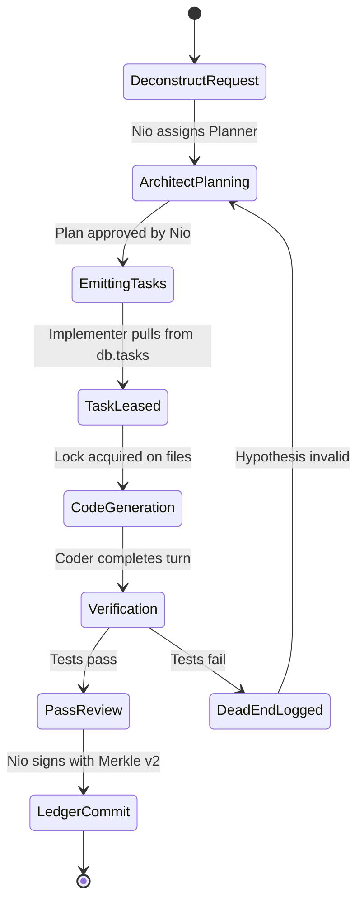

# Nio Bridge & Nio Assemble Specification

_Universal Coding Agent Relay (`bridge`) & Autonomous Multi-Agent Conductor (`assemble` / `unify`)_

---

## 1. Executive Summary & Vision

Modern software engineering with AI is fragmented across specialized coding agents (Antigravity/AGY, Claude Code, OpenAI Codex, Cursor, Aider). Each tool operates in a **siloed, ephemeral sandbox**:
* Context and conversational history are trapped in vendor-specific local caches.
* When one agent hits a reasoning dead-end, context window exhaustion, or architectural impasse, handing off work to another agent requires manual copy-pasting, re-prompting, and lost momentum.
* Negative knowledge (**dead-ends**, failed hypotheses, rejected approaches) is discarded, causing subsequent agents to repeatedly loop through the same failed attempts.

By leveraging **NioDB** (as an ultra-fast, embedded, tamper-proof blackboard) and **`@nio-labs/nio-db.js`** (as the lightweight client SDK), Nio introduces two foundational modules:

1. **`nio bridge` (Universal Context & Agent Relay)**:
   A universal context adapter that manages session goals, architectural decisions, file diffs, active skills, personas, and negative memory. Developers can **hot-swap** between coding agents (`nio switch agy -> claude -> codex`) with 0 context loss.

2. **`nio assemble` *(unify)* (The AI Conductor & Swarm Chair)**:
   Nio acts as the **Lead / Chair** orchestrating an autonomous multi-agent ensemble (`nio assemble agy claude codex`). Nio breaks requests into a dependency DAG, assigns roles (Architect, Coder, Tester, Arbiter), coordinates execution via NioDB task queues, enforces concurrency file locks, and records mathematical provenance in NioDB's Cryptographic Merkle Ledger.

---

## 2. High-Level Architecture

```text
                               ┌────────────────────────────────────────────────────────┐
                               │                    NIO CONTROL PLANE                   │
                               └───────────┬────────────────────────────────┬───────────┘
                                           │                                │
                ┌──────────────────────────┴──────────┐   ┌─────────────────┴────────────────────────┐
                │             MODULE 1                │   │                 MODULE 2                 │
                │            nio bridge               │   │          nio assemble (unify)            │
                │    (Context Relay & Hot-Swap)       │   │        (Multi-Agent Conductor)           │
                └──────────────────────────┬──────────┘   └─────────────────┬────────────────────────┘
                                           │                                │
                                           ▼                                ▼
┌────────────────────────────────────────────────────────────────────────────────────────────────────────────────────────┐
│                                             NioDB SHARED SUBSTRATE                                                     │
│                                                                                                                        │
│  ┌───────────────────────┐  ┌───────────────────────┐  ┌───────────────────────┐  ┌─────────────────────────────────┐  │
│  │  1. Session Manifest  │  │  2. Negative Memory   │  │  3. Task Queue (DAG)  │  │  4. Merkle Ledger v2            │  │
│  │  Active Goal, Diff,   │  │  Dead-Ends, Anti-     │  │  Distributed leases,  │  │  Tamper-proof agent             │  │
│  │  Decisions & Summary  │  │  Patterns, Rejected   │  │  timeouts & retries   │  │  provenance & attribution    │  │
│  └───────────────────────┘  └───────────────────────┘  └───────────────────────┘  └─────────────────────────────────┘  │
│                                                                                                                        │
│  ┌──────────────────────────────────────────────────┐  ┌────────────────────────────────────────────────────────────┐  │
│  │  5. Atomic KV Locks (Resource Mutexes)           │  │  6. Vector Memory & Project Knowledge                      │  │
│  │  Lock-free CAS file leases preventing collisions │  │  Fast cosine similarity search across docs & code snippets │  │
│  └──────────────────────────────────────────────────┘  └────────────────────────────────────────────────────────────┘  │
└────────────────────────────────────────────────────────────────────────────────────────────────────────────────────────┘
                    ▲                               ▲                               ▲
                    │                               │                               │
        ┌───────────┴───────────┐       ┌───────────┴───────────┐       ┌───────────┴───────────┐
        │       AGY Wrapper     │       │     Claude Wrapper    │       │     Codex Wrapper     │
        │  (Antigravity Engine) │       │      (Claude Code)    │       │   (OpenAI / Cursor)   │
        └───────────────────────┘       └───────────────────────┘       └───────────────────────┘
```

---

## 3. Module 1: `nio bridge` (Universal Context & Agent Relay)

### 3.1 The Problem It Solves
When switching from Claude to AGY or Codex, a developer typically copies prompts, forgets to mention files modified three turns ago, and fails to mention why a previous approach was discarded. `nio bridge` standardizes the agent runtime interface so that **agent engines become interchangeable execution backends**.

### 3.2 The Nio Context Interchange Format (Session Manifest)
Rather than blindly passing hundreds of thousands of raw conversational tokens between models, `nio bridge` compiles a dense, structured **Session Manifest**:

```json
{
  "session_id": "sess_01j9a8bc4",
  "title": "Implement Distributed Task Queue with Visibility Timeouts",
  "goal": "Build an in-memory & durable work-stealing queue with DLQ and lease expiration",
  "active_agent": "agy",
  "model_tier": "strong",
  "persona": "systems_architect",
  "files_touched": [
    "src/storage.rs",
    "src/queue.rs",
    "tests/queue_test.rs"
  ],
  "architectural_decisions": [
    "Use atomic CAS over in-memory lease buckets",
    "Persist task state frames to journal.jsonl under Event::TaskCreated/Leased/Acked",
    "Default visibility timeout is 30 seconds"
  ],
  "dead_ends": [
    {
      "hypothesis": "Use crossbeam bounded channels directly across Tokio runtime",
      "reason": "Channels cannot survive server reboot; durable recovery requires queue head in NioDB journal",
      "agent": "claude"
    }
  ],
  "recent_turns": [
    { "turn": 1, "agent": "claude", "summary": "Drafted initial Rust structs and state enum" },
    { "turn": 2, "agent": "agy", "summary": "Implemented lease timeout reaper and unit tests" }
  ]
}
```

### 3.3 Agent Adapters
`nio bridge` uses modular Node/Rust adapter shims:
* **AGY Adapter (`adapters/agy.js`)**: Interfaces with Google Antigravity (`agy` CLI, IDE bridge, or IPC sidecar).
* **Claude Adapter (`adapters/claude.js`)**: Wraps Anthropic's Claude Code CLI / MCP server.
* **Codex Adapter (`adapters/codex.js`)**: Wraps OpenAI Codex / Cursor agent execution hooks.
* **Generic Adapter**: Any agent supporting MCP (Model Context Protocol) or JSON-RPC.

### 3.4 Negative Memory (The Dead-End Register)
When an agent attempts a solution that fails (e.g. tests fail to compile, circular dependency introduced), `nio bridge` records it via `db.session(id).logDeadEnd(...)`. 

When the user runs `nio switch <agent>`, the incoming agent is explicitly instructed:
> *"The following approaches have already been proven invalid for this task: [Dead-Ends List]. DO NOT repeat them."*

### 3.5 Developer CLI Experience
```bash
# 1. Initialize or connect to a bridged session
nio bridge --agent claude --goal "Refactor query engine to native AST"

# 2. Inspect active shared manifest & touched files
nio context

# 3. Log a dead-end explicitly or automatically on failed verification
nio dead-end "Tried regex parser; failed on recursive parenthesis"

# 4. Seamless hot-swap: hand off immediately to AGY
nio switch agy

# 5. Seamless hot-swap: hand off to Codex
nio switch codex
```

---

## 4. Module 2: `nio assemble` *(unify)* (The AI Conductor & Swarm Chair)

### 4.1 Concept: Nio as the Chair of the Board
In `assemble`, Nio is not just a passive relay; **Nio acts as the Lead Architect & Conductor**.
Instead of the user deciding when to prompt each agent, Nio breaks down high-level requests, distributes roles, coordinates handoffs, prevents file collisions, and arbitrates conflicts.

```bash
nio assemble agy claude codex "Build Raft consensus engine for NioDB"
```

### 4.2 Role Specialization & Dynamic Assignment

```text
                       ┌────────────────────────────────┐
                       │          NIO CHAIR             │
                       │    (Conductor & Arbiter)       │
                       └───────────────┬────────────────┘
                                       │
            ┌──────────────────────────┼──────────────────────────┐
            ▼                          ▼                          ▼
  ┌───────────────────┐      ┌───────────────────┐      ┌───────────────────┐
  │  THE ARCHITECT    │      │  THE IMPLEMENTER  │      │   THE VERIFIER    │
  │   (e.g. Claude)   │      │    (e.g. AGY)     │      │   (e.g. Codex)    │
  ├───────────────────┤      ├───────────────────┤      ├───────────────────┤
  │ • System RFCs     │      │ • High-speed code │      │ • Test generation │
  │ • Task breakdown  │      │ • File mutations  │      │ • Lint & fuzzing  │
  │ • Interface specs │      │ • AST transforms  │      │ • Regression check│
  └───────────────────┘      └───────────────────┘      └───────────────────┘
```

1. **The Architect / Planner** *(e.g. Claude 3.7 Sonnet / o3)*:
   - Evaluates requirements, creates design blueprints, specifies data types.
   - Creates actionable task items in `db.tasks` with prerequisites.
2. **The Implementer / Coder** *(e.g. Antigravity (AGY) / Codex)*:
   - Claims leased tasks from the queue.
   - Acquires resource locks via NioDB KV (`lock:src/raft.rs`).
   - Writes production code and updates manifests.
3. **The Verifier / Tester** *(e.g. Codex / Local Test Worker)*:
   - Generates edge-case test suites.
   - Executes compilation, unit tests, and performance benchmarks.
   - Emits PASS or FAIL with diagnostics into the task result.
4. **The Chair / Arbiter (Nio)**:
   - If a task FAILS $\ge 2$ times, pauses implementation, logs negative hypothesis, and re-invokes the Architect to adjust the plan.
   - Once all tasks pass, triggers Merkle Ledger verification and commits the change.

### 4.3 Autonomous Swarm State Machine



### 4.4 Cryptographic Provenance in Assemble
Because NioDB includes the **Tier 1 Cryptographic Merkle Ledger (Ledger v2)**, every action taken by every member of the ensemble is tracked with mathematical accountability:
```json
{
  "version": 2,
  "seq": 1042,
  "prev_hash": "7a8b9c...",
  "payload": {
    "event": "agent_action",
    "ensemble_id": "ens_42",
    "agent_role": "implementer",
    "agent_name": "agy",
    "files_modified": ["src/raft.rs"],
    "action_summary": "Added heartbeat timer wheel"
  },
  "hash": "3c4d5e..."
}
```

---

## 5. NioDB & SDK Contracts Supporting Both Modules

### 5.1 NioDB Collections

| Collection | Purpose | Schema / Key Fields |
| :--- | :--- | :--- |
| `sessions` | Root session state | `title`, `goal`, `model_tier`, `active_agent`, `status`, `metadata` |
| `session_turns` | Chronological turns | `session_id`, `agent`, `model`, `summary`, `files_touched`, `tokens`, `cost_usd` |
| `dead_ends` | Negative memory register | `session_id`, `hypothesis`, `reason`, `agent`, `created_at` |
| `tasks` | Swarm task queue (DAG) | `session_id`, `title`, `prompt`, `priority`, `status`, `assigned_to`, `progress`, `result` |
| `agent_configs` | Personas, skills & keys | `agent_name`, `system_prompt`, `skills_granted`, `model_override` |

### 5.2 Atomic KV Concurrency Locks
When multiple agents run in `assemble`, they must not write to the same file simultaneously:
* **Acquire Lease**:
  `PUT /api/v1/kv/lock:src/storage.rs?mode=ephemeral&ttl=60` with payload `{"owner": "agy_worker_1"}` using `SETNX`.
* **Release Lease**:
  `DELETE /api/v1/kv/lock:src/storage.rs` when task finishes.

### 5.3 Model Context Protocol (MCP) Integration
NioDB's native MCP server (`/mcp` and `/api/v1/mcp`) natively exposes:
* `niodb://session/<id>`: Resolves to the compiled markdown manifest.
* `niodb://schema`: Exposes collection structures.
* `niodb://active-tasks`: Exposes pending items in the ensemble DAG.
* Tools: `niodb_get_session_manifest`, `niodb_log_dead_end`, `niodb_create_record`, `niodb_search_records`.

---

## 6. Implementation Roadmap

```text
Phase 1: Bridge Foundations (Weeks 1–2)
  ├── 1. Standardize Nio Context Interchange Format (NCIF) in NioDB
  ├── 2. Implement Agent Adapter Shims:
  │     ├── Google Antigravity (AGY)
  │     ├── Claude Code
  │     └── OpenAI Codex / Cursor
  ├── 3. Implement CLI commands: `nio bridge`, `nio switch`, `nio context`
  └── 4. Unit & integration tests for seamless context handoffs

Phase 2: Assemble Engine (Weeks 3–4)
  ├── 1. Role Engine & Taxonomy (Chair, Architect, Implementer, Verifier)
  ├── 2. Task DAG Generator (Decompose prompt -> dependency graph in db.tasks)
  ├── 3. Distributed Work-Stealing Loop with KV File Leases
  ├── 4. Dead-End Auto-Arbitration & Planner Re-Triggering
  └── 5. Merkle Provenance integration (audit trails for swarm actions)

Phase 3: Visual Cockpit & Monitoring (Weeks 5–6)
  ├── 1. Live Ensemble Swimlanes in Web Console (/console)
  ├── 2. Token, Latency & Cost Tracking across agents
  └── 3. Interactive Human-in-the-Loop review gates
```

---

## 7. Status & Sign-off

| Dimension | Specification Status |
| :--- | :--- |
| **Architecture Version** | `v1.0.0-draft` |
| **Storage Substrate** | NioDB `v1.0.4` (Ledger v2, Monotonic Seq, Merkle Provenance) |
| **Target Clients** | `@nio-labs/nio-db.js`, `nio-db-py`, `nio` CLI |
| **Next Action** | Review and proceed to Phase 1 implementation |
